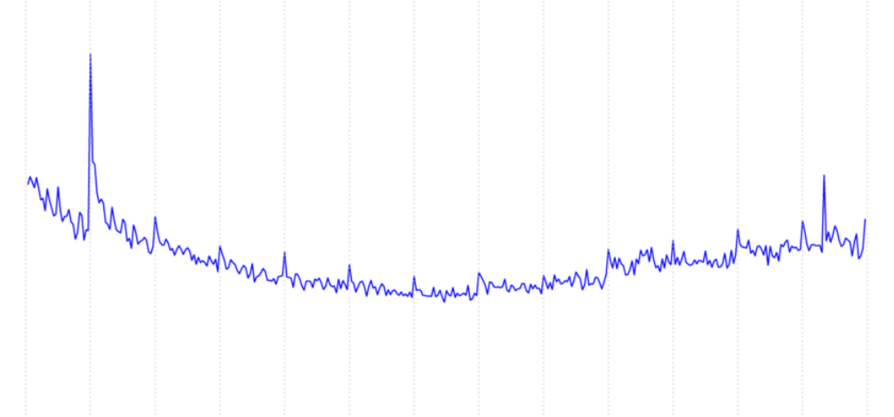
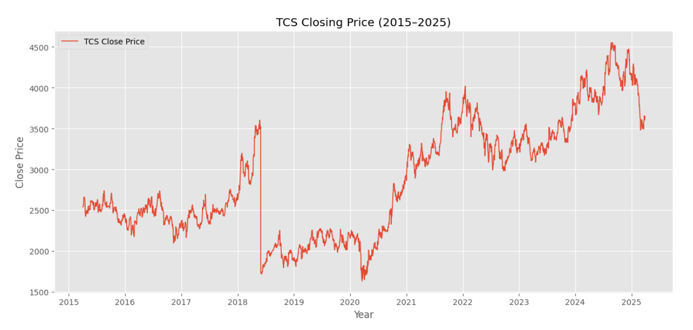
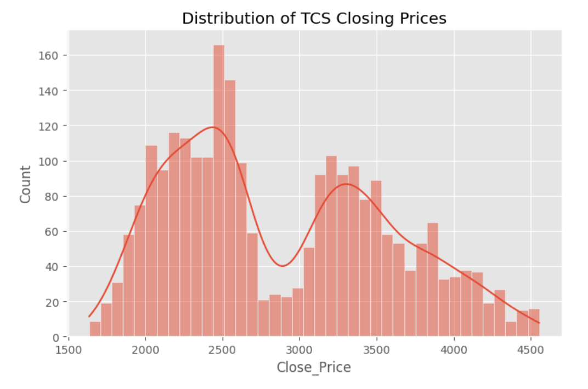
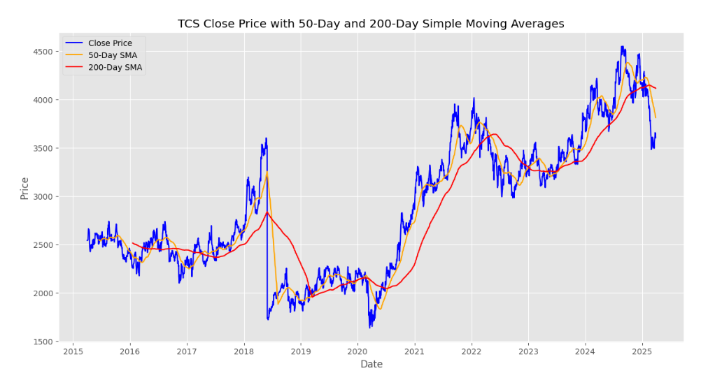
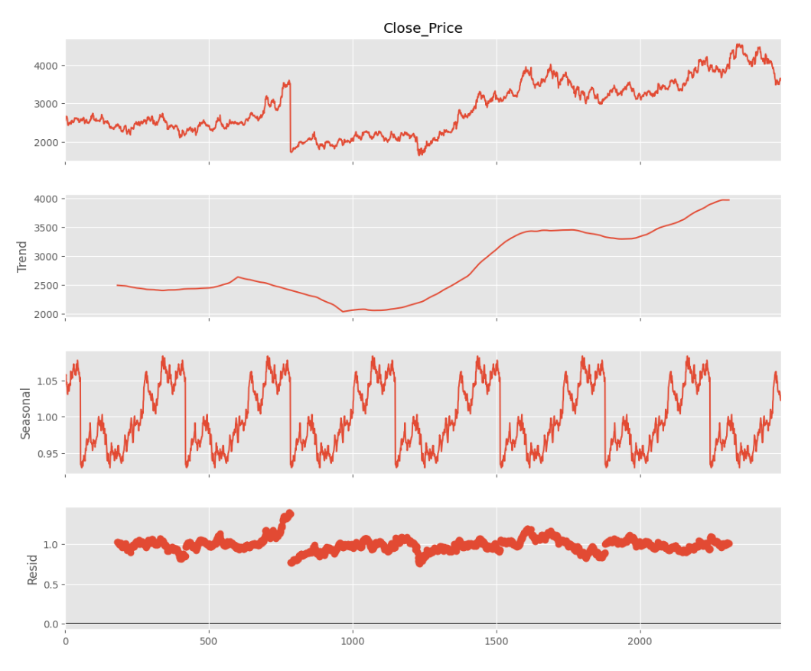
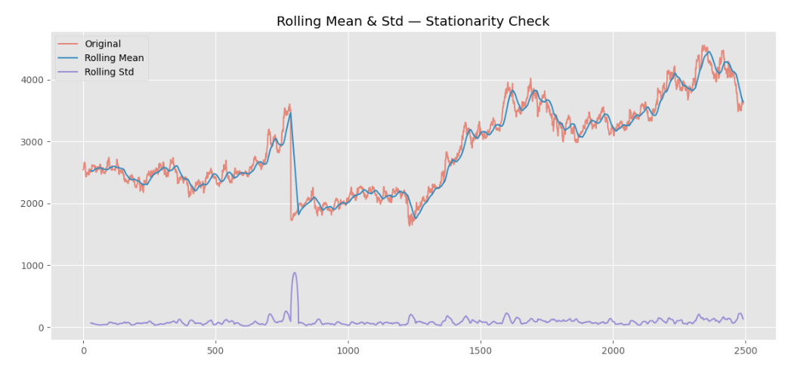
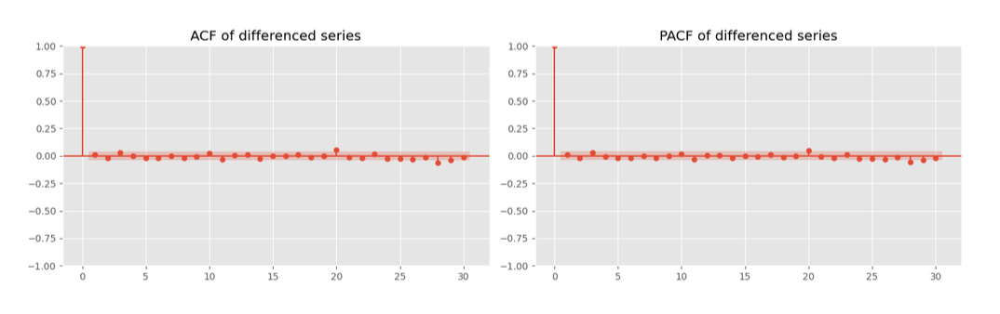
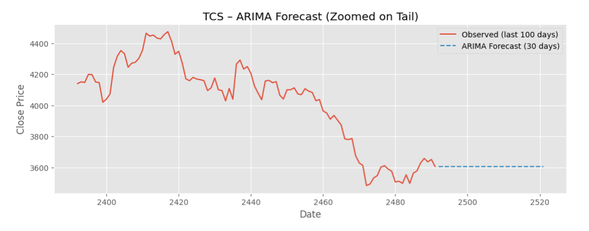
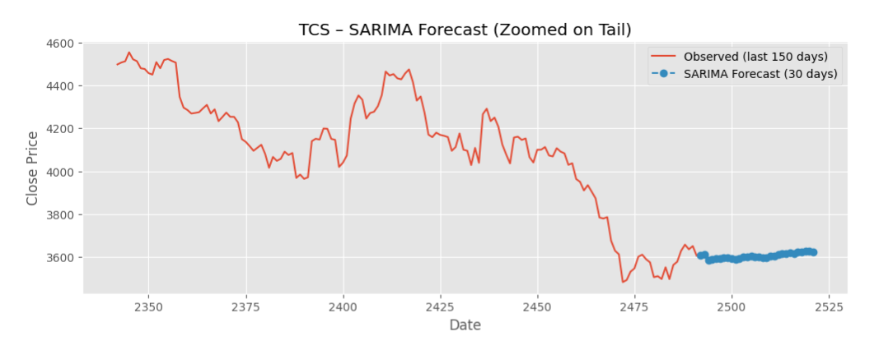

# Financial Time Series & Portfolio Forecasting : TCS (2015-2025)

> **Applied Statistical Methods | MATH F432** | November 2025 \
> Thilak S · Under Prof. Sumanta Pasari \
> Department of Mathematics, BITS Pilani 

[](https://www.python.org/)
[](https://www.statsmodels.org/)
[](https://scipy.org/)
[](LICENSE)
[](https://colab.research.google.com/drive/1ez7CSYgPsVoVq-BXQyVm3YWgSKs_D4Cl?usp=sharing)
[](https://drive.google.com/file/d/1ml-DV5bJA8EZulhCa91VB0FBTXETR5tu/view?usp=share_link)

---

## Overview

This project presents a rigorous **econometric and statistical analysis** of Tata Consultancy Services (TCS) stock prices from **2015 to 2025** on the National Stock Exchange (NSE). Conducted as part of the Applied Statistical Methods course at BITS Pilani, the study investigates the stochastic nature of TCS stock returns, identifies the best-fit probability distribution, and evaluates the forecasting capability of classical linear time-series models.

The central finding — that TCS stock follows a **non-stationary random walk** (ARIMA(0,1,0)) with **heavy-tailed Student-t returns** (ν̂ = 3.606) — provides both a statistical and an economic interpretation consistent with the **Weak-Form Efficient Market Hypothesis**.

---

## Key Results at a Glance

| Metric | Value |
|---|---|
| Best-fit return distribution | Student-t (ν̂ = **3.606**) |
| Best-fit price distribution | Weibull (k̂ > 1) |
| ADF test — price level | Non-stationary (p = 0.357) |
| ADF test — first difference | Stationary, I(1) (p < 0.001) |
| Optimal ARIMA specification | **ARIMA(0, 1, 0)** — Random Walk |
| SARIMA AIC (best seasonal fit) | 26,819.8 (spurious — invertibility issue) |
| Residual kurtosis | 445.54 (extreme fat tails) |
| SIP recommendation | Monthly SIP — 12.44% CAGR |

---

## Table of Contents

- [Background](#background)
- [Data — What to Download & Where](#data--what-to-download--where)
- [Repository Structure](#repository-structure)
- [Methodology](#methodology)
- [Results & Discussion](#results--discussion)
- [Conclusions & Investor Recommendations](#conclusions--investor-recommendations)
- [How to Run](#how-to-run)
- [Dependencies](#dependencies)
- [References](#references)

---

## Background

### Why TCS?

Tata Consultancy Services (TCS) is one of India's largest and most liquid IT sector companies, listed on the NSE and a constituent of the Nifty 50. With a market history spanning over two decades, TCS provides a rich dataset for exploring the statistical properties of large-cap Indian equity — particularly useful for examining market efficiency in an emerging economy context.

### Research Questions

1. What is the best-fit probability distribution for TCS closing prices and log-returns?
2. Is the TCS price series stationary, or does it follow a random walk?
3. Can ARIMA or SARIMA models meaningfully forecast future prices?
4. What practical investment strategies does the evidence support?

---

## Data — What to Download & Where

The analysis uses **TCS historical daily closing price data from 2015 to 2025**, downloaded as yearly CSV files from the NSE India website. The preprocessing pipeline consolidates these into a single time series.

### How to download TCS data from NSE

1. Go to **https://www.nseindia.com**
2. In the search bar, type **TCS** and select **Tata Consultancy Services**
3. Click on the **Historical Data** tab
4. Set the date range — download **one year at a time** (e.g. Jan 2015 – Dec 2015, then Jan 2016 – Dec 2016, ... up to 2025)
5. Click **Download (.csv)** for each year
6. You will get files named like `TCS_2015.csv`, `TCS_2016.csv` etc.

**Alternative — use Yahoo Finance (easier):**

1. Go to **https://finance.yahoo.com/quote/TCS.NS/history**
2. Set date range to **01 Jan 2015 → today**
3. Click **Download** — this gives you one single CSV covering the full period
4. Rename it to `TCS_NSE_2015_2025.csv`

> The Colab notebook handles both formats — multiple yearly CSVs or a single combined CSV. It standardizes column headers, parses dates, and applies the 2018 stock split correction automatically.

### Place the data file(s)

Put your downloaded CSV(s) into the `data/` folder in the repo root before running the notebook:

```
tcs-financial-time-series/
└── data/
    └── TCS_NSE_2015_2025.csv   ← your downloaded file goes here
```

---

## Repository Structure

```
tcs-financial-time-series/
│
├── data/
│   └── TCS_NSE_2015_2025.zip          # TCS historical closing prices (download separately — see above)
├── notebooks/
│   └── TCS_Analysis.ipynb                     # Full analysis notebook (Google Colab)
│
├── outputs/
│       ├── 01_intraday_volatility_profile.png
│       ├── 02_tcs_closing_price_2015_2025.png
│       ├── 03_distribution_closing_prices.png
│       ├── 04_moving_averages_50_200_day.png
│       ├── 05_stl_decomposition.png
│       ├── 06_rolling_mean_std_stationarity.png
│       ├── 07_acf_pacf_differenced_series.png
│       ├── 08_arima_forecast_zoomed.png
│       └── 09_sarima_forecast_zoomed.png
│
└── README.md
```

> **Note:** The full analysis notebook is hosted on Google Colab (link at the top). The `data/` folder is not committed to the repo — download the TCS CSV and add it locally before running.

---

## Methodology

### 1. Data Preprocessing

Raw TCS closing price CSV files across multiple years were consolidated, standardized, and cleaned. Key preprocessing steps:

- **Header standardization** — reconciled `ClosePrice` vs. `Close Price` across different download formats
- **Numeric parsing** — stripped comma separators from price/volume columns
- **Date parsing & sorting** — enforced chronological ordering for valid rolling statistics
- **Missing value handling** — addressed non-trading days to maintain time-series continuity
- **Stock split adjustment** — the May 2018 2:1 stock split creates a structural break; addressed through log-return transformation rather than price-level analysis

### 2. Return Transformation

Prices are modelled as a Geometric Brownian Motion process:

```
dPt = μ·Pt·dt + σ·Pt·dWt
```

Raw closing prices were transformed into **log-returns**:

```
Rt = ln(Pt / Pt-1)
```

Log-returns are additive across time, approximately stationary, and provide a valid domain for distribution fitting and ARIMA modeling.


*Figure 1: Intraday volatility profile — elevated variance at market open (09:15–10:15 IST) and close (14:30–15:30 IST)*

### 3. Price Evolution & Stock Split Impact


*Figure 2: TCS closing price (2015–2025). The steep drop in 2018 is the 2:1 stock split, not a market event. COVID-19 trough visible in early 2020.*

### 4. Distribution Fitting (MLE + AIC)

**Closing prices** — candidates tested via Maximum Likelihood Estimation:
- Normal → rejected (no lower bound; poor tail fit)
- Exponential → rejected (tail severely underestimated)
- Lognormal → reasonable but inadequate curvature fit
- **Weibull → best fit** by AIC/BIC (k̂ > 1, stretched right-skew)


*Figure 3: Empirical distribution of TCS closing prices with Weibull KDE overlay. Bimodality reflects pre- and post-COVID price regimes.*

**Log-returns** — **Student-t (ν̂ = 3.606) → best fit** — significantly heavier tails than Gaussian, confirming elevated tail-risk.

### 5. Trend Analysis — Moving Averages


*Figure 4: TCS close price with 50-day (orange) and 200-day (red) SMAs. Post-2020 recovery shows a sustained Golden Cross.*

### 6. Trend & Seasonality Decomposition

- **Multiplicative STL decomposition** applied (additive rejected — seasonal variance scales with trend level)
- Trend: upward trajectory ~₹2,000 → ₹4,000+
- Seasonal: repetitive ≈1.00 envelope consistent with quarterly earnings cycles
- Residuals: heteroscedastic, increasing variance post-2020


*Figure 5: Multiplicative STL decomposition. Residual spike at ~index 750 corresponds to the 2018 stock split.*

### 7. Stationarity Testing — ADF

| Series | ADF Stat | p-value | 1% CV | 5% CV | Result |
|---|---|---|---|---|---|
| Close Price (Level) | -1.847 | 0.357 | -3.433 | -2.863 | **Non-Stationary** |
| Close Price (1st Diff) | -49.356 | < 0.001 | -3.433 | -2.863 | **Stationary I(1)** |


*Figure 6: Rolling mean (cyan) tracks the price trend, confirming time-dependent mean µt. Rolling std (purple) spikes at the 2018 split.*

### 8. ACF / PACF Analysis

Both ACF and PACF of the differenced series showed **no statistically significant autocorrelation** at any positive lag — the series behaves as **white noise** post-differencing.


*Figure 7: All lags beyond zero fall within the 95% confidence interval — consistent with ARIMA(0,1,0).*

### 9. Time Series Forecasting Models

#### ARIMA(0, 1, 0) — Random Walk
Optimal specification by AIC/BIC. Flat forecast confirms **Weak-Form Efficient Market Hypothesis**.


*Figure 8: ARIMA(0,1,0) 30-day forecast. Flat trajectory at ~₹3,600 — the best linear forecast is the last observed price.*

#### SARIMA(1,1,1)×(1,1,1)₃₀
Lower AIC (26,819.8) but Θ₃₀ ≈ −1.0 → invertibility failure. Spurious seasonal fit.


*Figure 9: SARIMA 30-day forecast. Near-flat trajectory and invertibility failure confirm spurious fit.*

---

## Results & Discussion

### Model Comparison

| Model | Log-Likelihood | AIC | BIC | Verdict |
|---|---|---|---|---|
| AutoReg(2) | -13492.63 | 26993.26 | 27016.54 | Lowest AIC (best linear fit) |
| MA(2) | -13502.67 | 27013.33 | 27036.61 | Poor fit |
| ARMA(2,2) | -13498.43 | 27008.85 | 27043.77 | Over-parameterized |
| ARIMA(1,1,1) | -13502.42 | 27010.84 | 27028.30 | Redundant parameters |
| **ARIMA(0,1,0)** | — | — | — | **Preferred by parsimony** |
| SARIMA(1,1,1)×(1,1,1)₃₀ | — | 26819.8 | — | Spurious — invertibility issue |

### Three Core Econometric Findings

**Non-Stationarity & Random Walk** — TCS price is I(1). First-differenced returns behave as white noise. No linear signal extractable from historical prices.

**Heavy-Tailed Risk Profile** — Student-t with ν̂ = 3.606 implies extreme market events occur far more frequently than a Gaussian model predicts. Standard deviation-based risk measures systematically understate downside risk.

**Forecasting Efficacy** — ARIMA and SARIMA models characterize the random walk and test for seasonality — they do not generate actionable price forecasts.

---

## Conclusions & Investor Recommendations

### 1. Adopt Disciplined, Systematic Investing
Monthly SIP matches daily/weekly SIP returns (~12.44% CAGR) while minimizing administrative costs. Market timing fails statistically.

### 2. Utilize Tail-Risk Quantifiers
Use Student-t parameters (ν̂ = 3.606) to compute:
- **Value-at-Risk (VaR)** at 95% and 99% confidence
- **Expected Shortfall (CVaR)** for true tail exposure

### 3. Limit Forecasting Utility
ARIMA/SARIMA are valid for market efficiency testing and 1–5 day tactical framing. Long-range price forecasting requires GARCH, Stochastic Volatility, or LSTM approaches.

---

## How to Run

### Option 1 — Google Colab (Recommended)

[](https://colab.research.google.com/drive/1ez7CSYgPsVoVq-BXQyVm3YWgSKs_D4Cl?usp=sharing)

1. Open the Colab link above
2. Upload your `TCS_NSE_2015_2025.csv` to the Colab session (or mount Google Drive)
3. Run all cells

### Option 2 — Local Setup

```bash
git clone https://github.com/Thilak-Srinivasan/tcs-financial-time-series.git
cd tcs-financial-time-series

# Download TCS data (see Data section above) and place in data/
mkdir -p data
# copy your TCS_NSE_2015_2025.csv into data/

pip install -r requirements.txt
jupyter notebook
```

---

## Dependencies

```txt
pandas>=2.0
numpy>=1.24
matplotlib>=3.7
seaborn>=0.12
scipy>=1.11
statsmodels>=0.14
scikit-learn>=1.3
jupyter
```

```bash
pip install -r requirements.txt
```

---

## References

1. **Pasari, S.** (2025). *MATH F432: Applied Statistical Methods — Course Notes and Assignment Guidelines*. Department of Mathematics, BITS Pilani.

2. **Fisher Group (Grp 3).** (2025). *Data Analysis for Investments: Financial Time Series & Portfolio Forecasting (TCS)*. Assignment Report, MATH F432, BITS Pilani. [Report PDF](https://drive.google.com/file/d/1ml-DV5bJA8EZulhCa91VB0FBTXETR5tu/view?usp=share_link)

3. **Hyndman, R. J., & Athanasopoulos, G.** (2018). *Forecasting: Principles and Practice* (2nd ed.). OTexts. https://otexts.com/fpp2/

4. **Nau, R.** (2020). *ARIMA(0,1,0) model with constant (random walk with drift)*. Duke University. https://people.duke.edu/~rnau/411arim.htm

5. **Investopedia.** *Autoregressive Integrated Moving Average (ARIMA)*. https://www.investopedia.com/terms/a/autoregressive-integrated-moving-average-arima.asp

6. **Wikipedia.** *Autoregressive Integrated Moving Average*. https://en.wikipedia.org/wiki/Autoregressive_integrated_moving_average

7. **GeeksforGeeks.** *SARIMA — Seasonal Autoregressive Integrated Moving Average*. https://www.geeksforgeeks.org/machine-learning/sarima-seasonal-autoregressive-integrated-moving-average/

8. **Phosgene89.** *ARIMA and SARIMAX Models*. https://phosgene89.github.io/sarima.html

9. **Williams, J.** (2023). *Stock Forecasting with the SARIMA Model*. Medium. https://medium.com/@juliawilliams_79854/stock-forecasting-with-the-sarima-model-edad16d37445

10. **Fiveable.** *Ljung-Box Test and White Noise Processes*. https://fiveable.me/intro-time-series/unit-4/ljung-box-test-white-noise-processes/study-guide/OIbpshoxfpjQSmGM

11. **NIST/SEMATECH.** *e-Handbook of Statistical Methods — Box-Ljung Test*. https://www.itl.nist.gov/div898/handbook/pmc/section4/pmc4481.htm

12. **Fiveable.** *Evaluating Forecast Accuracy: MAE, RMSE, MAPE*. https://fiveable.me/intro-time-series/unit-8/evaluating-forecast-accuracy-mae-rmse-mape/study-guide/ijqkb0CAqRaHLBFi

13. **Unofficed.** *Understanding the Results of ADF Test on Stock Market*. https://unofficed.com/courses/risk-management/lessons/understanding-the-results-of-augmented-dickey-fuller-adf-test-on-stock-market/

14. **Hyndman, R. J., & Athanasopoulos, G.** (2018). *Stationarity and Differencing*. https://otexts.com/fpp2/stationarity.html

15. **Meghan.** *Stock Price Prediction using ARIMA and SARIMA*. GitHub. https://github.com/M3GHAN/stock-price-prediction-ARIMA-SARIMA

16. **Quigley, M.** (2009). *Extreme Value Theory for Stock Returns*. University of Muenster. https://www.uni-muenster.de/Stochastik/paulsen/Abschlussarbeiten/Diplomarbeiten/Quigley.pdf

17. **Poisson Group.** (2023). *Stock Market Data Analysis for Investments: Analysis of ICICI Bank*. Reference Report, MATH F432. Internal Document, BITS Pilani.

18. **Zilliz AI.** *How do you choose parameters for an ARIMA model?* https://zilliz.com/ai-faq/how-do-you-choose-parameters-for-an-arima-model

---

> *"The closing values of TCS are modeled best using a Weibull distribution, while the log-return data are described by a heavy-tailed Student-t distribution. This result supports recent developments in financial theory that emphasize return-based modeling in contrast to raw level price modeling."*  
> — ASM G3 Report, November 2025

---

**Course:** MATH F432 - Applied Statistical Methods \
**Supervisor:** Prof. Sumanta Pasari | Associate Professor | Department of Mathematics, BITS Pilani \
**Period:** October–December 2025 \
**Contact:** f20220771@pilani.bits-pilani.ac.in
